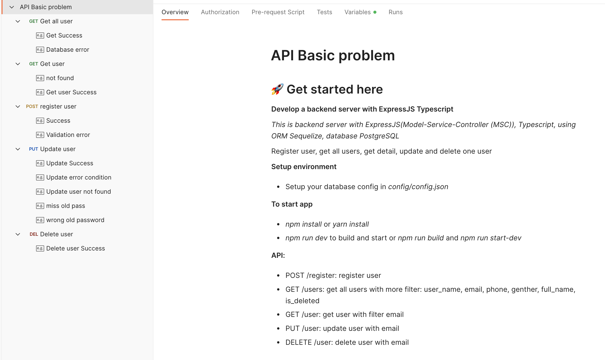

# Problem 5: Develop a backend server with ExpressJS Typescript
### This is backend server with ExpressJS(Model-Service-Controller (MSC)), Typescript, using ORM Sequelize, database PostgreSQL
*   Register user, get all users, get detail, update and delete one user
### Setup environment

* Setup your database config in `config/config.json`

### To start app

* `npm install` or `yarn install`
* `npm run dev` to build and start or `npm run build` and `npm run start-dev`

### API:

* POST /register: register user
* GET /users: get all users with more filter: user_name, email, phone, genther, full_name, is_deleted
* GET /user: get user with filter email
* PUT /user: update user with email
* DELETE /user: delete user with email

### You can use postman file (problem.postman_collection.json) to view the api, test it, and see possible error cases.
